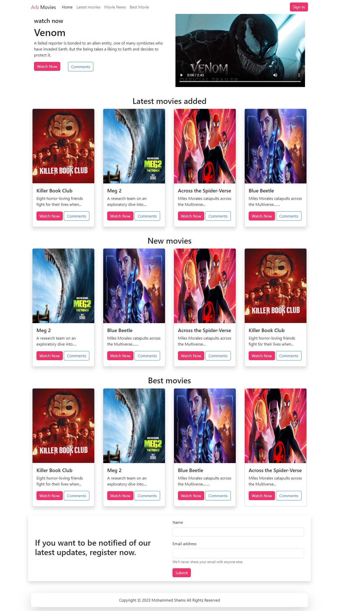

# Movie Web App

## Overview

This project is a simple movie web app that showcases a list of movies, including latest releases, new arrivals, and best picks. The app features a responsive design with a Bootstrap-based navbar, a banner section with video preview, and multiple sections for movie cards. Users can sign in, view movies, and subscribe to notifications.

## Features

- **Responsive Navbar**: Includes links to different sections of the site and a sign-in button.
- **Banner Section**: Displays a featured movie with a video preview and call-to-action buttons.
- **Movies Card Sections**: Displays lists of movies in different categories (Latest, New, and Best).
- **Subscription Form**: Allows users to subscribe for notifications about the latest updates.
- **Footer**: Contains copyright information.

## Technologies Used

- **HTML**: Structure of the web pages.
- **CSS**: Styling of the web pages.
- **Bootstrap**: Framework for responsive design and components.
- **JavaScript**: For Bootstrap's interactive components.

## Project Structure

- `index.html`: Main HTML file containing the structure of the web app.
- `./assets/vendor/bootstrap/css/bootstrap.min.css`: Bootstrap CSS for styling.
- `./assets/css/style2.css`: Custom stylesheet for additional styling.
- `./assets/images/`: Directory for image assets used in movie cards.
- `./assets/video/`: Directory for video assets used in the banner section.

## Project ScreenShot

